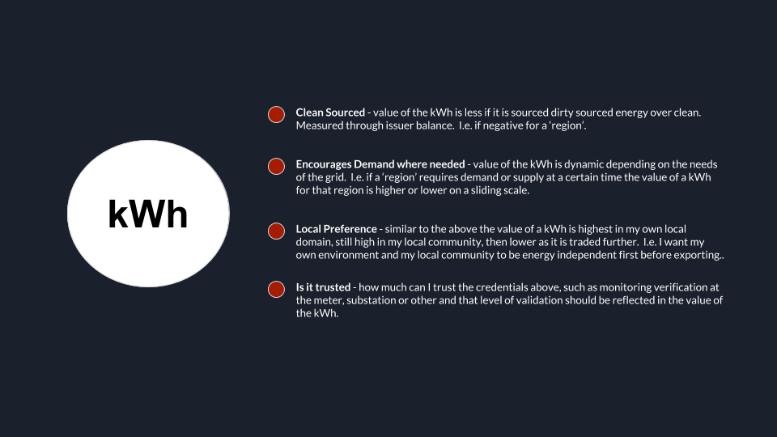

# Conceptual

## Objectives of the currency
the transformation we need to unlock with the currency design is that we need to change peoples relationship with energy.
we need to motivate and incentivize an understanding that energy is not yours... it's not something you buy, sell without consideration.
energy is a property of the commons.
how you I use energy in my world affects you and how you use energy in your world affects me.
we need to introduce a system that promotes behaviour beyond just buying and selling energy.. that instead promotes behaviour with that energy that benefits everyone.

for example the grid stability relies on people making deliberate decisions not to use certain assets or change the way in which they use them.

Our currency design needs to make these things visible and accountable.

It has five main objectives:
- enables a mechanism for energy 'value' trading that works P2P, M2M across businesses, manufacturers, device types, and geographical boundaries.
- rewards those who use clean energy efficiently and give more than they take.
- provides a reward/mechanism where those who give more than they take can prop up and support/subsidize those who want to invest in clean energy but cannot.
- rewards clean energy production and discourages dirty energy.
- rewards local trading and resilience.

## Introduction

## Baseline Measure
The baseline measure is kWh.  However a currency that measures and tracks kWh's is not enough to change behaviour.
We need to make visible other characteristics that are important to achieve the goals above.
These include:

## Participants and their motivations

### Distributors
Distributors operate the grid.  They need to be paid for that service so there needs to be a 'tax' offered to them for each transaction that traverses their infrastructure.
The design will also involve that substations, meters and other grid infrastructure is fitted with IoE monitoring equipment that will 'validate' kWh trading claims.

From the IoE motivation we want to encourage this group to transition their infrastructure from a feeder system to a full mesh system as fast as possible.

From their perspective the distributor is interested in cheaply being able to manage dynamic/unpredictable demand, lower overhead, and system resilience.

### Energy Consumers
End users need to be rewarded for using energy efficiently.  They also need to be rewarded to using energy in ways that benefits the local and global system stability.

From their perspective the end customer is interested in saving money, having control of their energy environment (reduce reliance).  They are also somewhat interested in clean energy outcomes as well as community reputation.

### Energy Producers
Producers want to monetise their service, either through saving money for themselves or making money through selling what they produce.
This includes good actors (clean energy producers) and fossil producers alike.  They wish to maximise the value they get from this sale.

From our perspective we want the same for the clean energy producers only, and we want it minimized for dirty producers.   But we want that energy to go to the right place which will usually not be the highest bidder.
The currency therefore needs to provide a value weighting that matches power to a need rather than power to the highest $ bidder

### Energy Storers
Same as above, these actors will be increasingly more important in our design as they are critical to the stability and timeliness of power provided.
These users as above wish to monetise the service they can provide.  Not only the power they distribute as an asset but also the time in which they release it.

From our perspective we want to encourage behaviour that has system benefits here and stores and releases energy at the times when it is most needed.  The currency value these actors get from that service needs to reflect that incentive.

Similarly the market value for them needs to reflect events that are happening like demand response or local stability etc.

### Capital contributors
There are parties that can contribute to our outcomes but perhaps not necessarily with energy trading directly.
These individuals are interested mainly for reputational reasons.

Our design needs a way to incorporate these contributors and feed their contributions into the system.
A possible mechanism for this is that contributions could be used to buy and contribute 'credits' into the system that might be used to 'offset' or subsidize certain user needs (community solar projects etc).
