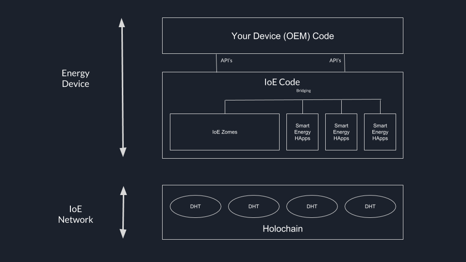
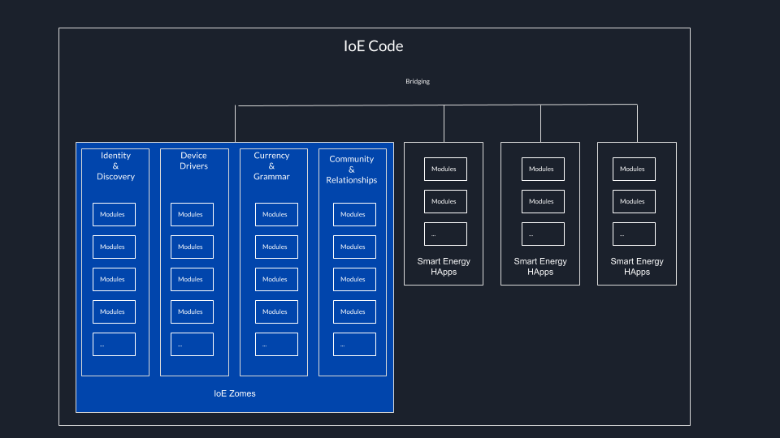

# Architecture
The IoE Architecture at a high level works as follows:

The IoE is build on three layers which are:
## Your Device and Code
The top layer is your device, or user interface.
This is your proprietary software that is used to control and interact with your device and will be unique to your specific device capability and blue-print.

The IoE 'Device Drivers' provide an interface specification and standard API for interactions with this layer.

## The IoE software and Smart Energy Apps
This layer is the libraries and modules that embed in your device (or interact with your device via API's) that give it an identity on the IoE and all the functionality that being part of the IoE community provides.

This is written in Rust and includes the Holochain HDK.
This layer is also where the relevant Smart Energy App code is written.

This software is embedded to your device (or hosted on Holo and integrated via API) and compiled to a WASM file which is called a DNA file.

## Holochain
IoE users when configured are given an immutable 'local' chain which captures and manages interactions.
In addition they are provided access to 'common spaces' which are Distributed Hash Tables (DHT's) on the Holochain service.
DHT's are what device communities use to communicate and orchestrate.
Every Holochain (and in turn every IoE) App creates its own DHT community and network based on the rules set in its DNA.

# Internet of Energy Components
The IoE standard provides features and capabilities to create and connect all three layers above.

From a functions and capabilities point of view the IoE modules are categorised and built as as follows:

Note- Zomes in Holochain terms can be considered like Libraries or Modules.

- Identity and Discovery Zomes
- Basic Device Driver Zomes
- Currency and Grammar Zomes
- Community and Relationship Zomes

The following sections describe each of these areas and the configuration elements for each.
