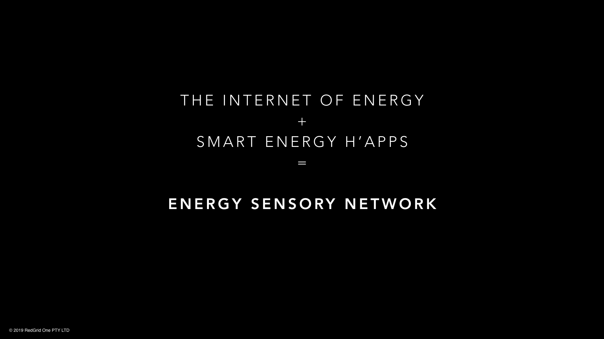

# The IoE Architecture
The Internet of Energy (IoE) Protocol is one component of a layered architecture that combines to form to what we call an 'Energy Sensory Network'.

The ESN comprises of 3 separate layers.

## Internet of Energy Layer
The IoE layer provides any energy consuming, storing, monitoring, or generating device with the following:
- a common standard for creating and obtaining an identity
- a common method for discovering peers or interesting 'relatives'.
- API standards that enable a device to act (based on it's capabilities) to signals received through its communities (device drivers).
- A current-see (currency) for value transfer between participants in the system and those that surround it that is based on the principles of clean energy transformation that the Internet of Energy Mission is based upon.
- Protocols and methods for devices to find and join new communities or leave existing ones.

The following sections provide detail on the features, characteristics, operation, and configuration options within each of these layers.
